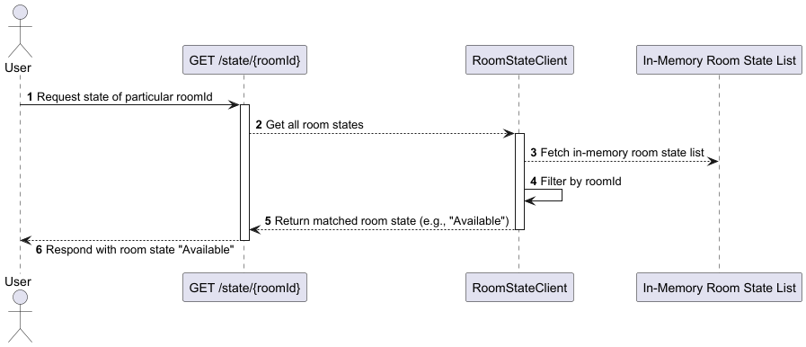

# Lab8-Room State Service: Configurable RoomId (Quarkus Microservice)

This is a **Java Quarkus-based microservice** that provides room state information. It exposes a REST API endpoint to retrieve a specific room's state (e.g., *Available*, *Reserved*, *Maintenance*, *Occupied*).

---

## Overview

The service allows users to:

- **Query the current state** of a specific room by its ID.   
- It uses an in-memory list to manage room states and is optimized for fast response and minimal overhead.
---

## Components

- **User**: The client sending HTTP requests.
- **GET `/state/{roomId}`**: REST endpoint to retrieve the state of a specific room.
- **RoomStateClient**: A component that manages access to the in-memory room state list.
- **In-Memory Room State List**: The internal data store holding current room states.

---

## Key Configurations

RoomId is configurable in this quarkus microservice. It can read values from external environment variables at runtime:

**`application.properties`**
```properties
manning.workout.room1=${ROOM_ONE:1}
manning.workout.room2=${ROOM_TWO:11}
manning.workout.room3=${ROOM_THREE:22}
manning.workout.room4=${ROOM_FOUR:33}
manning.workout.room5=${ROOM_FIVE:44}
```
* **ROOM_ONE** → Name of env variables of first room.
* **ROOM_TWO** → Name of env variables of second room.
* **ROOM_THREE** → Name of env variables of third room.
* **ROOM_FOUR** → Name of env variables of fourth room.
* **ROOM_FIVE** → Name of env variables of fifth room.
---

## Sequence Flow

### 1. Check Room State

**Endpoint**: `GET /state/{roomId}`  
**Port**: `8082`

#### Flow:

1. User requests the state of a room via its `roomId`.
2. The service controller handles the request.
3. The controller calls the `RoomStateClient`.
4. `RoomStateClient` fetches the complete in-memory list of room states.
5. It filters the list to match the requested `roomId`.
6. The matched room state (e.g., `"Available"`) is returned to the user.

---

## Sequence Diagram



>The diagram above illustrates the end-to-end interaction between the user, API endpoint, and services.

---

## How to Run the Application

This service uses the **Quarkus Docker extension**, which simplifies containerization.

### Step 1: Build the Docker Image

Run the following Quarkus command to build the image:

```bash
mvn clean package -Dquarkus.container-image.build=true
```

### Step 2: Run the Container

Use Docker to run the service:

```bash
docker run -p 8082:8082 tause/room-state-client-quarkus:1.0.0-SNAPSHOT
```

Once running, the endpoint is available at:  
`http://localhost:8082/state/{roomId}`

---

## Tech Stack

- Java 17+
- [Quarkus](https://quarkus.io/)
- RESTEasy Reactive
- Docker (via Quarkus container image extension)

---
